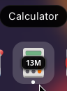

# Memory Usage Badges

GNOME Shell extension that displays RAM usage badges on Dash app icons.

## Screenshots

### Low Memory Usage


### High Memory Usage


## Features

- Shows memory usage as compact badges on Dash app icons
- Aggregates memory across all processes matching the application executable name
- Color-coded: black for normal usage, red for high memory (≥ 2 GB)
- Updates every 5 seconds
- Minimal performance overhead

## Compatibility

GNOME Shell 45, 46, 47, 48

## Installation

### From Source

```bash
cd ~/.local/share/gnome-shell/extensions/
git clone https://github.com/mohamedahmed-dev/memory-usage-badges.git memory-usage-badges@mohamed
```

Or download and extract:

```bash
cd ~/.local/share/gnome-shell/extensions/
cp -r /path/to/memory-usage-badges memory-usage-badges@mohamed
```

Then restart GNOME Shell:
- **X11:** Press `Alt+F2`, type `r`, press Enter
- **Wayland:** Log out and log back in

Enable the extension:

```bash
gnome-extensions enable memory-usage-badges@mohamed
```

## Technical Details

### Memory Calculation

Uses VmRSS (Resident Set Size) from `/proc/[pid]/status`. Aggregates memory across all processes by matching executable name or command line. This provides values consistent with what users see in application task managers and GNOME System Monitor.

### Implementation

Monkey-patches `AppDisplay.AppIcon._init` to inject `St.Label` badges. Memory updates run via `GLib.timeout_add` at 5 second intervals, with work spread across multiple frames to prevent UI freezing. Proper cleanup on disable removes all injected UI elements and restores original AppIcon behavior.

## Troubleshooting

Check logs for errors:
```bash
journalctl -f -o cat /usr/bin/gnome-shell
```

Verify extension is enabled:
```bash
gnome-extensions list --enabled | grep memory-usage-badges
```

## Contributing

Issues and pull requests are welcome at [github.com/mohamedahmed-dev/memory-usage-badges](https://github.com/mohamedahmed-dev/memory-usage-badges)

## License

MIT